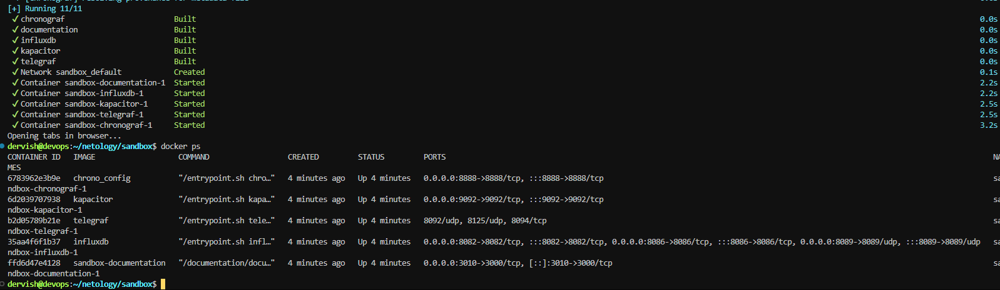
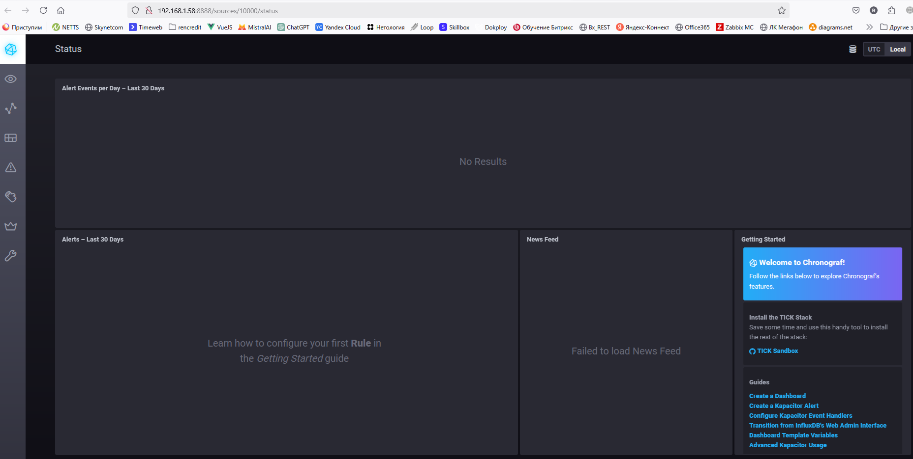
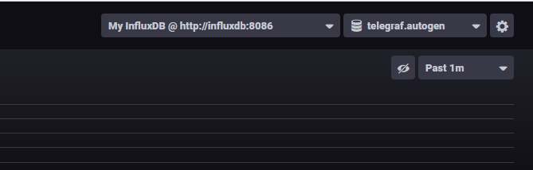
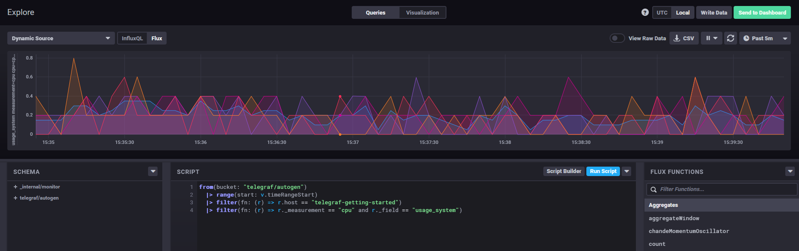
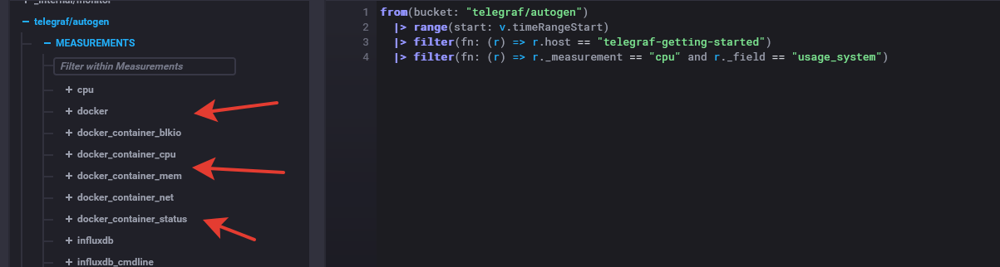

## Обязательные задания

1. Вас пригласили настроить мониторинг на проект. На онбординге вам рассказали, что проект представляет из себя платформу для вычислений с выдачей текстовых отчетов, которые сохраняются на диск. Взаимодействие с платформой осуществляется по протоколу http. Также вам отметили, что вычисления загружают ЦПУ. Какой минимальный набор метрик вы выведите в мониторинг и почему?

>Ответ: CPU LA - чтобы отслеживать загрузку ЦПУ. Время отклика (min, max, avg) - для отслеживания скорости обработки запросов к сервису. Уровень ошибок - для отслеживания успешности\не успешности запросов. Загрузка RAM - для отслеживания загрузки ОЗУ. IOPS, Inodes, FS - для отслеживания работы файловой системы.

2. Менеджер продукта посмотрев на ваши метрики сказал, что ему непонятно что такое RAM/inodes/CPUla. Также он сказал, что хочет понимать, насколько мы выполняем свои обязанности перед клиентами и какое качество обслуживания. Что вы можете ему предложить?

>Ответ: метрики RAM - показывают наличие свободной памяти, от ее количества зависит скорость работы сервиса, Inodes - это структура, которая хранит информацию о файловой системе, кол-во inodes ограничено, когда они заканчиваются - становится невозможно создавать новые файлы на дисках. CPUla - показывает степень загруженности ЦПУ, если процессор сильно загружен - замедляется работа сервера в целом. Для понимания степени выполнения обязанностей перед клиентами необходимо заключить SLA c клиентом, определить SLI и начать учитывать MTBF (Mean Time Between Failures) — среднее время между сбоями и MTTR (Mean Time To Recovery) среднее время восстановления после сбоя.

3. Вашей DevOps команде в этом году не выделили финансирование на построение системы сбора логов. Разработчики в свою очередь хотят видеть все ошибки, которые выдают их приложения. Какое решение вы можете предпринять в этой ситуации, чтобы разработчики получали ошибки приложения?

>Ответ: попробовать выделить из имеющихся ресурсов хост для разворачинания на нем ELK или VictoriaMetrics

4. Вы, как опытный SRE, сделали мониторинг, куда вывели отображения выполнения SLA=99% по http кодам ответов. Вычисляете этот параметр по следующей формуле: summ_2xx_requests/summ_all_requests. Данный параметр не поднимается выше 70%, но при этом в вашей системе нет кодов ответа 5xx и 4xx. Где у вас ошибка?

>Ответ: Ошибка в том, что помимо 2хх кодов ответа необходимо также учитывать коды 1хх и 3хх, которые тоже являются успешными кодами ответа.

5. Опишите основные плюсы и минусы pull и push систем мониторинга.

>Ответ: плюсы pull

    1. легче контролировать подлинность данных
    2. можно настроить единый proxy server до всех агентов с TLS
    3. упрощённая отладка получения данных с агентов

>минусы pull

    1. менее эффективен для мониторинга больших систем, где количество устройств может быть слишком большим
    2. медленнее реагирует на изменения в контролируемой системе

>плюсы push

    1. упрощение репликации данных в разные системы мониторинга или их резервные копии
    2. более гибкая настройка отправки пакетов данных с метриками
    3. это менее затратный способ передачи данных, из-за чего может возрасти производительность сбора метрик

>минусы push

    1. требует установки агентов на контролируемые системы
    2. передает все метрики системы, некоторые из них могут быть не нужными для анализа

6. Какие из ниже перечисленных систем относятся к push модели, а какие к pull? А может есть гибридные?

>Ответ:
    
    Prometheus - pull
    TICK - push
    Zabbix - гибрид, push и pull
    VictoriaMetrics - гибрид, push и pull
    Nagios - гибрид, push и pull

7. Склонируйте себе [репозиторий](https://github.com/influxdata/sandbox/tree/master) и запустите TICK-стэк, используя технологии docker и docker-compose. В виде решения на это упражнение приведите скриншот веб-интерфейса ПО chronograf (http://localhost:8888).
P.S.: если при запуске некоторые контейнеры будут падать с ошибкой - проставьте им режим Z, например ./data:/var/lib:Z




8. Перейдите в веб-интерфейс Chronograf (http://localhost:8888) и откройте вкладку Data explorer.
    
    - Нажмите на кнопку Add a query
    - Изучите вывод интерфейса и выберите БД telegraf.autogen

    

    - В measurments выберите cpu->host->telegraf-getting-started, а в fields выберите usage_system. Внизу появится график утилизации cpu.
    - Вверху вы можете увидеть запрос, аналогичный SQL-синтаксису. Поэкспериментируйте с запросом, попробуйте изменить группировку и интервал наблюдений.
Для выполнения задания приведите скриншот с отображением метрик утилизации cpu из веб-интерфейса.



9. Изучите список [telegraf inputs](https://github.com/influxdata/telegraf/tree/master/plugins/inputs). Добавьте в конфигурацию telegraf следующий плагин - [docker](https://github.com/influxdata/telegraf/tree/master/plugins/inputs/docker):

```
[[inputs.docker]]
endpoint = "unix:///var/run/docker.sock"
gather_services = false
source_tag = false
container_names = []
storage_objects = []
timeout = "5s"
perdevice = true
total = false
docker_label_include = []
docker_label_exclude = []
tag_env = [“JAVA_HOME”, “HEAP_SIZE”]
```

После настройке перезапустите telegraf, обновите веб интерфейс и приведите скриншотом список measurments в веб-интерфейсе базы telegraf.autogen . Там должны появиться метрики, связанные с docker.


